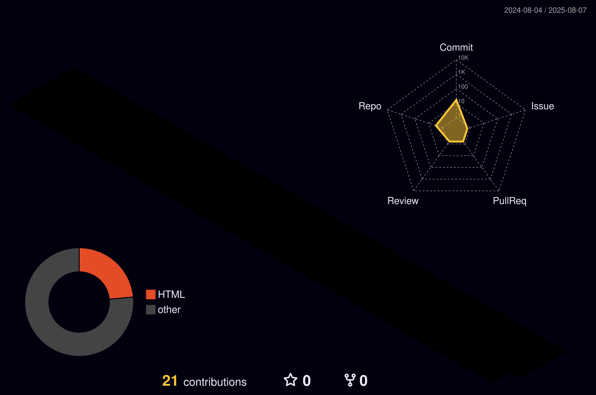

<h1 align="center">Rafael de Oliveira Lima</h1>

  Programador Web e Mobile.

---

---

## Sobre

Técnico em Desenvolvimento de Sistemas (ETEC Jardim Ângela). Graduando em Sistemas para Internet (SENAC)

## Projetos em destaque

- [TechTodoDia](https://techtododia.com.br/) – Portal de notícias sobre tecnologia.
- [Orgulho Cacheado](https://orgulhocacheado.com.br/) – Portal de notícias sobre cabelos cacheados.
- [Star Kids](https://www.mediafire.com/file/w5co6424uux7ien/Star_Kids.apk/file) – Aplicativo Mobile para Alfabetização de Crianças.

## Contato

- [WhatsApp]([https://www.linkedin.com/in/lucascorreaa/](https://wa.me/5511981117549?text=Olá!+Gostaria+de+saber+mais+sobre+seus+serviços+de+desenvolvimento+de+sites+e+apps.+Por+favor,+entre+em+contato+para+podermos+conversar+sobre+projetos+e+orçamentos.
))
- [Portfólio](https://professorcorrea.com.br/)
- [Instagram - Rafa_Zurgadao](https://www.instagram.com/rafa_zurgadaoo/)

---

> Educar é tornar o saber algo com voz, sentido e sentimento.
