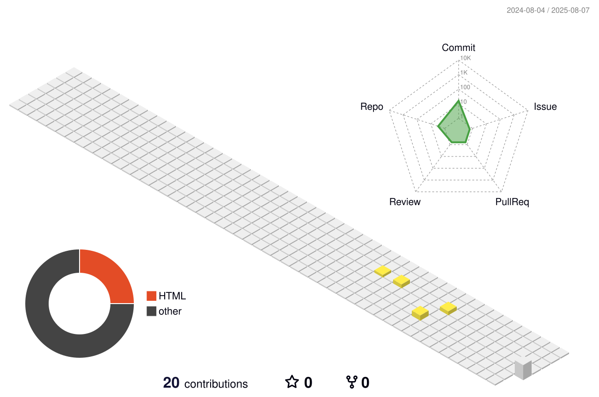

<h1 align="center">Rafael de Oliveira Lima</h1>

  Programador Web e Mobile.

---

---

## Sobre

Técnico em Desenvolvimento de Sistemas (ETEC Jardim Ângela). Graduando em Sistemas para Internet (SENAC)

## Projetos em destaque

- [Toque AI](https://toqueai.com.br/) – Plataforma de QR Code para identificação e gestão de pets, pessoas e objetos
- [Suporte de Domingo](https://suportededomingo.com.br/) – Soluções digitais e agendamento personalizado
- [Code Trouble](https://codetrouble.com.br) – Comunidade aberta para desenvolvedores e troca de conhecimento

## Contato

- [LinkedIn](https://www.linkedin.com/in/lucascorreaa/)
- [Suporte de Domingo](https://suportededomingo.com.br/)
- [Portfólio](https://professorcorrea.com.br/)
- [Instagram - Professor Corrêa](https://www.instagram.com/professorcorrea)

---

> Educar é tornar o saber algo com voz, sentido e sentimento.
